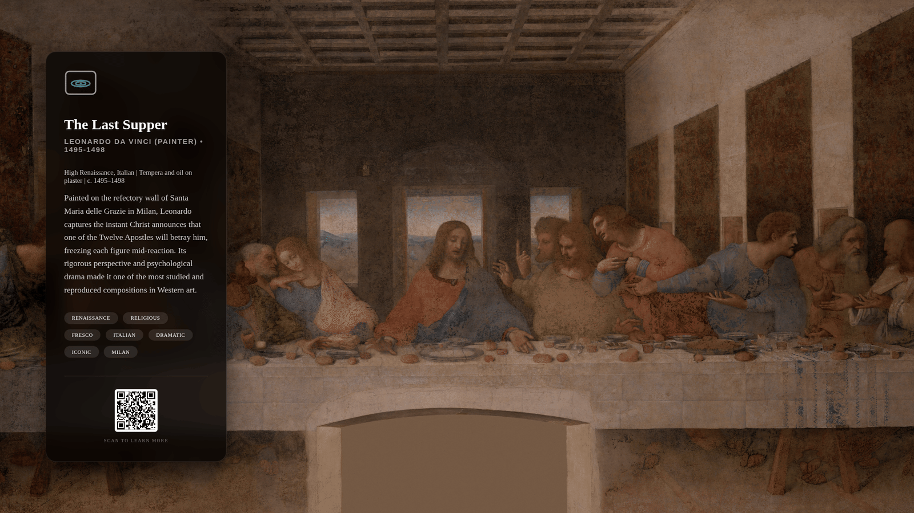
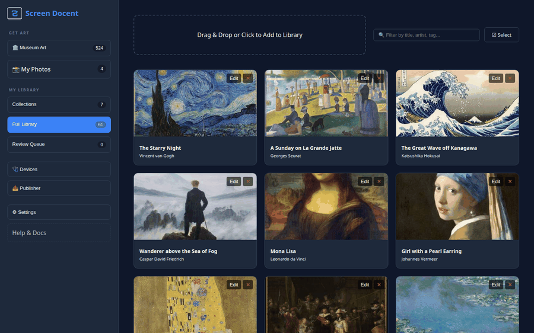

# 🖼️ Screen Docent

[](https://github.com/AiwendilInTheWoods/Screen-Docent/actions/workflows/pytest.yml)
[](https://github.com/AiwendilInTheWoods/Screen-Docent/actions/workflows/verify-sources.yml)
[](LICENSE)

**Screen Docent** is an open-source, AI-powered digital art curator and signage platform. It transforms any TV or monitor into a high-end museum display, complete with autonomous artwork analysis, intelligent metadata generation, and instant mobile remote control.



> *A live display: full-bleed artwork, an auto-generated museum placard, and a QR code for details.*

## ✨ Features

*   **🕵️ Museum Art Scouts:** Effortlessly search and pull high-res masterpieces directly from world-class APIs (The Met, Art Institute of Chicago, SMK, Cleveland, Rijksmuseum) straight into your discovery queue — plus **NASA** space photography and **Wikimedia Commons** (the broadest public-domain pool, filtered to PD works at display-grade ≥2000px). All keyless. Supports premium integrations for Harvard Art Museums, Smithsonian, and Europeana.
*   **🧠 Vision RAG Curator:** Automatically generates museum-grade VRA Core metadata for all artworks. The system features a built-in multilingual translation pipeline that automatically converts foreign metadata (e.g., Dutch Open Data from the Rijksmuseum) into fluent English using Gemini's visual grounding.
*   **🏛 VRA Core Database:** Built on the established Visual Resources Association schema, securely housing rich metadata alongside dynamic crop data and playlists. Supports Many-to-Many relationships for flexible artwork-to-playlist mapping and custom sequencing.
*   **📱 WebSocket Remote:** A mobile-first, no-refresh PWA remote to switch playlists, change modes, and trigger placards instantly.
*   **📺 Multi-Display Support:** Targeted routing using unique display IDs allows a single server to manage different artwork streams across multiple TVs.
*   **🎨 Advanced Rendering:** Choose between cinematic Ken Burns pans, static user-defined crops, or blurred matte effects. The Ken Burns pan is **focal-point-aware** — every artwork carries a focal point (AI-derived, or tap-to-set) so off-center subjects, like a portrait's face, stay framed instead of being slowly panned out of view.
*   **📸 My Photos (Studio):** A phone-first studio to put your *own* photos on the wall — multi-upload (with camera capture), optional AI captions (in a warm photo-album voice, with an honest on-device-vs-cloud privacy note), and tap-to-set framing. **iPhone HEIC photos work as-is** (auto-converted on upload). Your photos are stored **locally on your server** — never uploaded to anyone's cloud, never indexed — and shown with a clean caption (zero museum jargon).
*   **⚖️ Hierarchical Config:** Precise control via URL parameters that override playlist and global defaults.
*   **🔒 Human-in-the-Loop:** Audit and refine AI-generated content before it goes live. Finalize a live find with **inline review** — its card expands in place into an editable placard that the AI fills in as you watch, Approve right there with no tab-hop — or batch it in the dedicated **Review Queue** (with **☑ Select → Approve & Publish** for many at once).
*   **🔌 Bring Your Own Model:** Configure the AI engine from the GUI — Google Gemini, OpenAI, Anthropic, OpenRouter (one-click sign-in), or a local Ollama/LM Studio server — all through one OpenAI-compatible backend. No code edits, validated live before saving.
*   **🖼️ Browse Catalog:** A curated, collection-first library of ~520 public-domain masterpieces across **24 collections** — from Impressionism, the Dutch Golden Age, and Ukiyo-e to Baroque, Ancient Egypt, Maps & Cartography, and the Cosmos — sourced from world-class museums, NASA, Wikimedia Commons, and the Smithsonian (CC0), every image gated to display-grade (≥2000px). Ready-made placards and **pre-baked focal points** (so subjects stay framed) included. Browsing is instant (text + hotlinked thumbnails); the full-resolution image downloads only when you **Add** a piece — one at a time, or **☑ Select** several and **Add selected**. One **Museum Art** search box (with title/artist **autocomplete**) spans the curated catalog and, when curated comes up short, escalates the same query to a **live museum search**. Regenerate/expand the catalog anytime with the offline builder (`python -m tools.build_catalog`) — and you can **host the built manifest on any static URL** (GitHub raw, an object store, any web server) and point the app at it in **Settings → 📚 Catalog Source** to grow the catalog without rebuilding the image (it falls back to the bundled catalog if the URL is unreachable).
*   **🌐 Federated Collections (beta):** Subscribe to a publisher's collection by URL and browse it alongside the bundled catalog, tagged **Official**, **Verified**, or **Community**. Feeds are an open [Manifest v2](docs/manifest-v2.md) format — we index pointers (images stay on the publisher's server), safety-check and validate every feed, and verify Ed25519 signatures for the *Verified* tier. Configure in **Settings → 🌐 Subscriptions**. **Publishing your own?** Author and sign a collection in the **Publisher Studio** (`/publisher`) or from the command line (`python -m tools.build_manifest`) — see [How to publish](docs/how-to-publish.md).
*   **💾 Persistent & Safe:** SQLite-backed state with automatic migrations and Docker volume persistence.

## 🧭 Deployment Models

Screen Docent is a **curation brain** you run once (a small Docker app) + **any screen** you point at
it. The same server supports any mix of these at once — it's a versatile setup, not a single appliance:

| Model | What it is | Best for |
|-------|-----------|----------|
| **Run the brain anywhere** | Docker on a server / NAS / mini-PC / old laptop; point any screen at it. | The foundation for everything below. |
| **All-in-one Pi** | Server **and** display on one Raspberry Pi. | The simplest single, self-contained art frame. |
| **Thin-client Pi → server** | Cheap Pis display; one central server curates. | Scaling to many rooms / whole-home. |
| **Any browser / Smart TV** | Point a TV browser (or Fully Kiosk) at the display URL. | Reusing a TV you already own — no extra hardware. |
| **e-ink / "dumb" frame** | Low-power frames fetch a server-rendered, dithered image on a schedule (image API — see the e-ink section below). | Battery e-ink, DIY ESP32/Waveshare, TRMNL (BYOS). |
| **Multi-display** | One server drives many screens via unique `display` IDs. | A docent in every room, each remote-controllable. |



The full, illustrated guide (with screenshots and walkthroughs for each) lives in the in-app
**Help & Docs** page at `http://localhost:8000/help`.

## 🚀 Quickstart Deployment

The fastest way to get Screen Docent running is using Docker.

### 1. Prerequisites
*   [Docker](https://docs.docker.com/get-docker/)
*   [Docker Compose](https://docs.docker.com/compose/install/)

### 2. Launch
No config files needed — clone and go:
```bash
git clone https://github.com/AiwendilInTheWoods/Screen-Docent.git
cd Screen-Docent
docker compose up -d --build
```
(No `.env` required; the stack runs out of the box and you configure the AI model in-app below.)

### 3. Access the System
*   **Admin Dashboard:** `http://localhost:8000/admin` (Upload, discover, and manage art)
*   **Main Display:** `http://localhost:8000/` (Point your TV browser here)
*   **Mobile Remote:** `http://localhost:8000/remote` (Control from your phone)

### 4. Connect a Model (optional, in-app)
Screen Docent works immediately without any AI — the starter art ships with full placards, and the
museum **Discover** scouts need no key. To unlock auto-curation (metadata generation, enrichment,
smarter search), open **Admin → ⚙ Settings → 🧠 AI Engine**, pick a provider (Google Gemini, OpenAI,
Anthropic, OpenRouter, or a local Ollama/LM Studio server), paste a key (or **Sign in with
OpenRouter** for one-click setup), and click **Test & Save** — validated live, effective in seconds.

> Prefer files? You can still pre-seed a default Gemini key with a `.env` (`GEMINI_API_KEY=…`) in the
> project root before launch; the in-app setting overrides it when set.

## 🖥️ Display Appliance (recommended for TVs)

The easiest way to drive a TV or monitor is the **Docent Appliance**: flash a
Raspberry Pi, point it at your server, and it boots straight into the fullscreen
display — no Fully Kiosk, no browser chrome, no URL typing. See
[`deploy/appliance/`](deploy/appliance/README.md). For low-power panels, see the
**e-ink & BYOS frames** section below.

## 🖼️ e-ink & BYOS frames (image API)

Low-power e-ink and "bring-your-own-server" frames (DIY ESP32 + Waveshare, Inky Impression, a TRMNL
in BYOS mode) don't run the JS display — they just fetch a server-rendered image on a schedule:

```
GET /display/{display_id}/current.png?playlist=Masterpieces&w=1600&h=1200&palette=spectra6
```

The server runs the same curation brain (bag-shuffle + affinity), crops to the panel size, and
Floyd–Steinberg-dithers to the device palette. The response's **`X-Refresh-After`** header tells the
frame how long (seconds) to deep-sleep before the next fetch; each GET advances to the next image.

- **Palettes:** `spectra6` (E Ink Spectra 6), `acep7` (7-colour ACeP/Gallery), `gray4`, `gray16`.
- **Formats:** `.png` (default) or `.bmp` (firmware without a PNG decoder).
- **Fit:** `fit=cover` (fill, default) or `fit=contain` (letterbox on white).

## 🔌 Integrations

Thin clients that render the same curation brain on platforms people already run:

- **[Samsung Frame TV](integrations/frame-tv/)** — push curated art into a Frame's **Art Mode** over
  your LAN (no Samsung account, no Art Store subscription). Configure it in **Settings → 🖼️ Frame TV**
  (IP, playlist, interval) and the server keeps the Frame updated, reusing the same curation brain.
  Turns a Frame you already own into another Screen Docent display.
- **[MagicMirror²](integrations/MMM-ScreenDocent/)** — the `MMM-ScreenDocent` module turns a slot on a
  smart mirror into a rotating museum wall (current artwork + placard from your server). Front-end
  only, no extra setup; includes a `preview.html` to try it in any browser without MagicMirror.

## 🏛️ VRA Core Metadata Architecture

Screen Docent utilizes the **Visual Resources Association (VRA) Core** schema for its internal SQLite database design (`models.py`). This guarantees museum-quality structural integrity.
Supported schema properties mapped automatically by the AI include:
*   `title`
*   `agent_name` & `agent_role` (e.g., Maker, Artist, Photographer)
*   `creation_date` & `date_display` (e.g., 'c. 1890', '19th century')
*   `cultural_context` (e.g., 'Dutch', 'Edo Period')
*   `medium` (e.g., 'Oil on canvas')
*   `description_narrative` (Generated 2-sentence museum blurbs)
*   `tags` (Automated visual extraction tags)

## 🛠️ Configuration Hierarchy

Screen Docent uses a strict priority system for settings like `cycle_time`, `mode`, and `shuffle`:

1.  **URL Parameters:** `?mode=static-crop&cycle_time=60` (Highest Priority)
2.  **Playlist Defaults:** Configured per collection in the Admin UI.
3.  **Global Defaults:** System-wide fallbacks.

## 📖 Documentation
For URL parameters, the **Raspberry Pi appliance** how-to, **e-ink / "dumb" frame** setup, and hardware tips, visit the internal **Help & Docs** page at `http://localhost:8000/help` from your running server.

## 🔐 Advanced: Enabling HTTPS (optional)

**Do you need it?** For a home LAN, usually **no**. The display/kiosk path carries no secrets, and the
app works fine over plain HTTP. Plain HTTP is genuinely sufficient for most setups — the "Not secure"
label is mostly perception. HTTPS earns its keep in two specific cases:

1. **You expose the admin beyond your home/trusted LAN**, or want to stop API keys you paste into
   **Settings → AI Engine** from crossing the wire in plaintext.
2. **You want OpenRouter's one-click sign-in.** It uses a browser crypto API that only works in a
   *secure context* (HTTPS **or** `http://localhost`). Over `http://<LAN-IP>` the button is hidden and
   you paste an OpenRouter key instead — HTTPS (or accessing via `localhost`) restores one-click.

**Why not bake certs into the app:** Screen Docent streams to headless browsers (Smart TVs, Pi
kiosks) that can't click through a cert warning — a self-signed cert on the Python backend breaks
them with un-bypassable `ERR_CERT_AUTHORITY_INVALID`. So TLS is terminated by an **opt-in reverse
proxy**, and **kiosks keep using plain `http://`** (localhost on an all-in-one box, or
`http://<server>:8000`). HTTPS is for the **human-facing admin/remote**.

### Turn it on (built-in Caddy profile)
```bash
docker compose --profile tls up -d           # adds an HTTPS proxy on :443; app stays on :8000
```
This runs [Caddy](https://caddyserver.com/) in front of the app ([`deploy/tls/Caddyfile`](deploy/tls/Caddyfile)).

**End-to-end, the two honest paths** (browser-trusted HTTPS on a LAN always requires *one* of these):

* **A. Real domain (lock icon everywhere, zero manual trust) — recommended if you can.**
  Point a domain you own at this host's IP (a free DNS name works; split-horizon/local DNS is fine
  for LAN-only), then:
  ```bash
  echo "SD_TLS_HOST=art.example.com" >> .env     # your domain
  # remove the `tls internal` line in deploy/tls/Caddyfile
  docker compose --profile tls up -d
  ```
  Caddy fetches a trusted Let's Encrypt certificate automatically (ports 80+443 must be reachable).

* **B. LAN-only with Caddy's internal CA (no domain) — you must trust the CA once per device.**
  Leave the default (`SD_TLS_HOST=docent.local`, `tls internal`). Browsers will warn until you
  install Caddy's root CA on each phone/laptop that opens the admin:
  ```bash
  # grab the root CA Caddy generated, then trust it on your device(s)
  docker compose --profile tls cp caddy:/data/caddy/pki/authorities/local/root.crt ./caddy-root.crt
  ```
  Install `caddy-root.crt` into your OS/browser trust store (macOS Keychain, Windows "Trusted Root",
  iOS/Android profile). After that, `https://docent.local` shows a clean lock. Per-device, but
  one-time. (Tools like [mkcert](https://github.com/FiloSottile/mkcert) automate the same idea.)

> **Reminder:** don't point a TV/kiosk at the internal-CA HTTPS URL — it can't accept the cert. Keep
> displays on `http://` and reserve HTTPS for the admin/remote you open yourself.

---
*Built for art lovers, powered by AI.*
